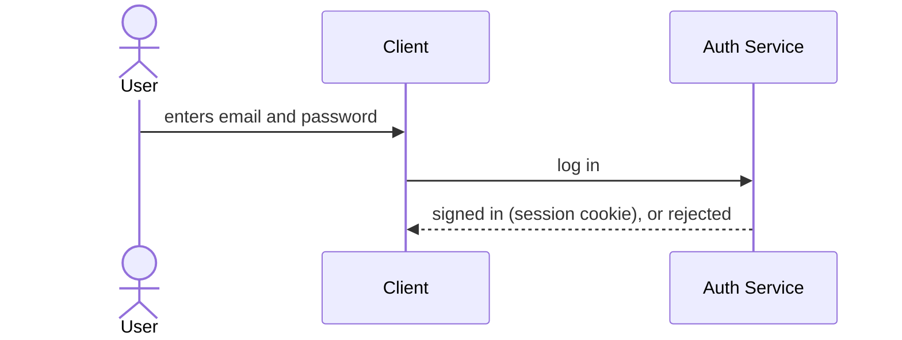
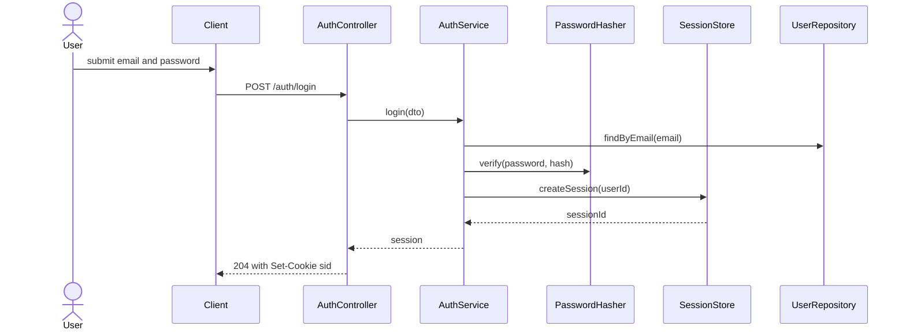
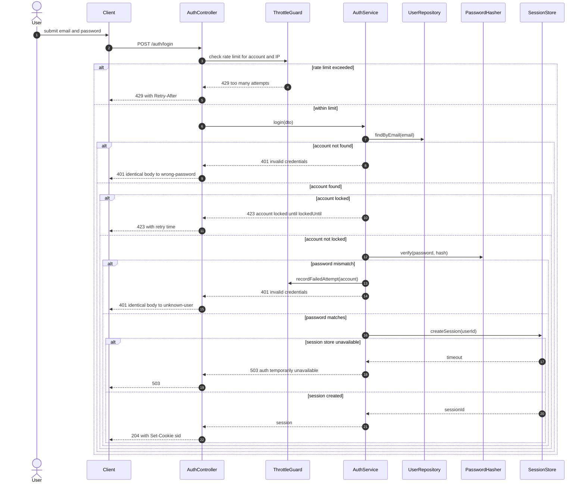

# The three detail levels

One page, one flow, three drawings, so the difference is visible instead of
described. The flow is the same one used in `specs/login/spec.md` — email+password
login — carried from orientation through to a debugging-grade spec. Validate any of
these with `python3 scripts/check_diagrams.py reviewers/_diagram-levels.md`.

| level | audience | node budget | what's collapsed | step table |
|---|---|---|---|---|
| **L1 high** | someone new, or a decision-maker approving direction | ≤ 12 nodes | every external system → one box; no retries, no error paths | not required |
| **L2 medium** | the implementer writing the code | ≤ 30 nodes | components shown individually; only calls crossing a component boundary | not required |
| **L3 detailed** | debugging, review, or an unambiguous spec | no cap | nothing — every branch, every error/timeout/retry path | **required**: numbered table below, ≥ 1 shown branch |

Declare the level right after the diagram-type line: `%% level: 1`. Leaving it out
is allowed — the level is inferred from node count and reported — but an inferred
diagram big enough to be L3 still owes L3's step table and branch, whether anyone
declared it or not.

## L1 — orientation

Three boxes. A reviewer approving "should we build first-party login" needs exactly
this and nothing else — no hashing algorithm, no lockout policy, no retry path.

## L2 — implementer

The client and the network boundary collapse into two participants; everything
inside the auth service that the implementer will actually write is shown
individually, and only the calls that cross a component boundary appear. This is
the diagram that belongs in a spec before code is written — it is what
`specs/login/spec.md` §4 draws, and what `scripts/design_drift.py` checks the
implementation against.

Seven nodes is small enough to also fit inside L1's budget — the budget is a
ceiling, not a floor. What makes this an L2 diagram is not size, it is that it
already commits to the internal collaborators (`PasswordHasher`, `SessionStore`,
`UserRepository`) an implementer needs and a decision-maker does not. Declare the
level explicitly when the content, not the size, is what makes it L2.

## L3 — debugging / unambiguous spec

Every branch a reviewer or an on-call engineer needs: rate limiting, unknown vs.
wrong-password (same response, on purpose — see E16 in the spec), account lockout,
and the downstream-timeout path. `autonumber` gives the diagram's own step numbers;
the table below is the mechanical requirement `check_diagrams.py` enforces.

| # | step | who | branch |
|---|---|---|---|
| 1 | User submits email and password | U → C | happy path |
| 2 | Client posts credentials | C → A `POST /auth/login` | happy path |
| 3 | Rate limit checked | A → T | happy path |
| 4 | Rate limited, request rejected | T → A → C, `429` | error: throttled |
| 5 | Within limit, user looked up | A → S → D | happy path |
| 6 | Unknown email rejected | S → A → C, `401` | error: not found (same body as #9) |
| 7 | Account found but locked | S → A → C, `423` | error: locked |
| 8 | Password verified against hash | S → K | happy path |
| 9 | Password mismatch, attempt recorded | S → T, S → A → C, `401` | error: wrong password (same body as #6) |
| 10 | Session created | S → R | happy path |
| 11 | Session store unavailable | R → S → A → C, `503` | error: downstream timeout |
| 12 | Session issued, cookie set | R → S → A → C, `204` | happy path |

## What changed between the three

- **L1 → L2**: `Auth Service` (one box) splits into the four components that own
  distinct failure modes; the client/network hop is now explicit as a boundary
  crossing rather than implied.
- **L2 → L3**: no new participants — `ThrottleGuard` is the only addition, because
  rate limiting has its own error path a debugger needs. Everything else is the same
  eight-or-fewer nodes, restructured around every branch instead of only the happy
  one, with the step table making the branches referenceable in a review comment
  ("see step 9") instead of a raw diff of arrows.

## Sources

Level naming (L1/L2/L3 as a zoom hierarchy of white-box/black-box decomposition) is
adapted from arc42's building-block view, which defines exactly this staged
zoom — `arc42/arc42-template@master:EN/adoc/05_building_block_view.adoc` ("Level 1
is the white box description of the overall system... Level 2 zooms into some
building blocks of level 1... Level 3 zooms into selected building blocks of level
2"). The C4 model's System Context / Container / Component / Code hierarchy
(`c4model.com`) is the same idea applied specifically to "where does this system
sit" diagrams — see the diagram-type table in `skills/diagramming/SKILL.md`.
