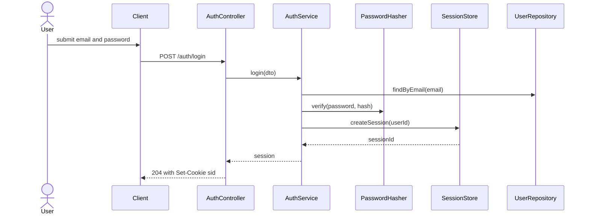

# login — spec

| field | value |
|---|---|
| kinds | auth, crud |
| stack | nestjs |
| created | 2026-09-29 |
| status | **ready** |

Worked example. It exists to show what `plan_feature.py` + `decide.py` produce for a
feature everyone thinks they already understand, and to be the fixture the eval
harness scores against. Every table below is machine-audited by
`python3 scripts/plan_feature.py audit specs/login`.

## 1. Outcome

A returning user signs in with email and password and receives a session that the
system can revoke immediately. A signed-in user can sign out of one device without
affecting their other devices. Nothing here covers registration, password reset, or
MFA — see out-of-scope.

## 2. In scope / out of scope

| # | in scope | | # | explicitly OUT of scope |
|---|---|---|---|---|
| S1 | email + password login, session issue | | O1 | registration / signup |
| S2 | logout, single device and all devices | | O2 | password reset and email verification (FOLLOW-UP-002) |
| S3 | immediate revocation on password change or admin ban | | O3 | MFA / TOTP (FOLLOW-UP-003, ADR-0002) |
| S4 | brute-force throttling and account lockout | | O4 | SSO / SAML for enterprise tenants |
| S5 | OAuth sign-in with one provider | | O5 | device/session management UI |

O2 is the one a reader assumes is included. It is not, and the edge cases it owns are
marked `deferred` below rather than silently dropped.

## 3. Interfaces touched

| # | surface | change | backward compatible? |
|---|---|---|---|
| I1 | `POST /auth/login` | new | yes — new route |
| I2 | `POST /auth/logout` | new, accepts `scope=device\|all` | yes — new route |
| I3 | `GET /auth/oauth/:provider/callback` | new | yes — new route |
| I4 | `users` table | add `password_hash`, `locked_until` | no — requires expand/contract, see §9 |
| I5 | `sessions` table | new | yes — additive |
| I6 | `Set-Cookie: sid` | new httpOnly cookie | yes — no existing cookie contract |

## 4. Sequence



`scripts/design_drift.py` compares these participants and messages against the
implementation and reports anything present in one and missing in the other.

## 5. Decisions required

Every row carries a recommended default. `chosen` of `default` means the default was
accepted deliberately — it is recorded, not unanswered.

| # | decision | options | deciding factor | default (recommended) | chosen | ADR |
|---|---|---|---|---|---|---|
| D1 | Session mechanism | opaque server session  \| stateless JWT  \| JWT+refresh rotation | does revocation need to be immediate? | opaque server session in an httpOnly cookie — immediate revocation, simplest correct option for a first-party app | opaque server session (default) | [ADR-0001](../../decisions/ADR-0001-session-strategy-for-login.md) |
| D2 | Password hashing | argon2id  \| bcrypt  \| scrypt | is a modern KDF library available on the runtime? | argon2id; bcrypt (cost>=12) if argon2 is unavailable | default | — |
| D3 | MFA | none  \| TOTP  \| WebAuthn  \| SMS | what does the threat model require? | TOTP, behind a feature flag, shipped after core login works | deferred to FOLLOW-UP-003 | [ADR-0002](../../decisions/INDEX.md) |
| D4 | Rate limiting location | app middleware  \| gateway/WAF  \| both | is there a gateway already? | gateway if one exists, plus a per-account app-level counter for lockout | default | — |
| D5 | Identity source | local credentials  \| OAuth/OIDC only  \| both | who are the users? | both, with local as the fallback; OAuth added as a second ADR not a rewrite | default | — |
| D6 | Session storage | redis  \| database table  \| signed cookie only | is a shared store available in the deploy target? | redis if present, otherwise a database table; never a signed cookie alone if A1 requires revocation | redis (default) | [ADR-0001](../../decisions/ADR-0001-session-strategy-for-login.md) |
| D7 | Concurrency control | none  \| optimistic (version/etag)  \| pessimistic locks | can two users edit the same record? | optimistic with a version column — cheap, and it surfaces conflicts instead of losing writes | default | — |
| D8 | Delete semantics | hard delete  \| soft delete  \| archive table | is there an audit or undo requirement? | soft delete with a partial index excluding deleted rows | default | — |
| D9 | Pagination | offset  \| cursor  \| keyset | can data change between pages? | cursor/keyset — offset silently duplicates and skips rows under concurrent writes | default | — |
| D10 | Validation boundary | controller DTO  \| service  \| database constraints | where can invalid data enter? | all three: DTO at the edge, invariants in the service, constraints in the schema as the backstop | default | — |

## 6. Open questions

| # | question | why it matters | recommendation (proceeding with this) | answered |
|---|---|---|---|---|
| Q1 | Session idle timeout and absolute lifetime? | changes the TTL and the refresh behaviour | 30 day absolute, 7 day idle, sliding on use — matches a consumer web app; tighten to 12h/1h if this becomes admin tooling | no |
| Q2 | Is redis guaranteed present in every deploy target? | ADR-0001 assumption A2 depends on it | proceed assuming yes; the store is behind a `SessionStore` interface so a Postgres implementation is a drop-in if A2 fails | no |
| Q3 | Which OAuth provider first? | changes only the provider adapter, not the flow | Google — largest coverage for the stated user base | no |

None of these block implementation, which is the test for whether a question belongs here.

## 7. Edge cases

31 seeded from the catalogue for kinds auth, crud. 26 covered by a named
test, 3 accepted as not-applicable with a reason, 2 deferred to a tracked follow-up.

| # | source | edge case | why it gets missed | status | test / reference |
|---|---|---|---|---|---|
| E1 | universal | Concurrent duplicate request (double-click, retried POST) | happy path is single-threaded in the author's head | covered | `auth.e2e-spec.ts` → `rejects a second concurrent login with the same nonce` |
| E2 | universal | Partial failure mid-operation | multi-step writes are written as if atomic | covered | `session.service.spec.ts` → `does not persist a session when audit-log write fails` |
| E3 | universal | Downstream dependency times out | local dev is always fast | covered | `session.store.spec.ts` → `redis timeout surfaces AuthUnavailable, not a hang` |
| E4 | universal | Downstream returns malformed or unexpected shape | the type says it cannot happen | covered | `oauth.provider.spec.ts` → `rejects an id_token failing schema validation` |
| E5 | universal | Empty, single-item, and very large collections | examples always have 3 items | accepted | login returns a single session; no collection surface in this feature |
| E6 | universal | Unauthorized and wrong-tenant access | only the authorized path is exercised | covered | `session.guard.spec.ts` → `tenant A session cannot read tenant B profile` |
| E7 | universal | Clock skew, DST boundary, timezone of the caller | the author's machine is UTC | covered | `session.ttl.spec.ts` → `expiry is computed in UTC across a DST transition` |
| E8 | universal | Input at boundary sizes and with unicode/emoji/RTL | tests use ascii names | covered | `login.dto.spec.ts` → `accepts unicode local-part, rejects >254 char email` |
| E9 | universal | Rate limit or quota exhausted | quota is never hit in dev | covered | `throttle.e2e-spec.ts` → `6th attempt in 60s returns 429 with Retry-After` |
| E10 | universal | Rollback path actually works | rollback is written, never run | covered | `migrate.spec.ts` → `up, down, up leaves schema and rows intact` |
| E11 | auth | Session revocation is immediate on logout, password change, and admin ban | revocation is assumed to follow from token expiry | covered | `revocation.e2e-spec.ts` → 3 cases, one per trigger |
| E12 | auth | Concurrent logins from multiple devices, and logout scope | single-device mental model | covered | `revocation.e2e-spec.ts` → `logout-one leaves the other device signed in` |
| E13 | auth | Credential stuffing / brute force on the login endpoint | rate limiting is 'infra's job' | covered | `throttle.e2e-spec.ts` → per-account counter plus per-IP gateway rule |
| E14 | auth | Timing difference between unknown-user and wrong-password | both return 401 so it looks fine | covered | `login.timing.spec.ts` → both paths run the KDF; delta < 15ms over 200 runs |
| E15 | auth | Password reset token reuse, expiry, and single-use | token is generated and forgotten | deferred | reset flow is out of scope O2 → tracked as FOLLOW-UP-002 |
| E16 | auth | Email enumeration via signup, reset, or login errors | error messages are written for humans | covered | `login.e2e-spec.ts` → `identical body and status for unknown vs wrong password` |
| E17 | auth | Session fixation on privilege change | the session id is kept across login | covered | `session.rotation.spec.ts` → `session id rotates on login and on role elevation` |
| E18 | auth | Open redirect in the post-login return URL | the redirect param is trusted | covered | `redirect.spec.ts` → `external host rejected; only same-origin paths allowed` |
| E19 | auth | CSRF on state-changing auth routes | SPA assumed immune | covered | `csrf.e2e-spec.ts` → `cross-origin POST without token is 403` |
| E20 | auth | Cookie flags: httpOnly, Secure, SameSite, correct domain and path | defaults are assumed safe | covered | `cookie.spec.ts` → asserts all four attributes on Set-Cookie |
| E21 | auth | Account lockout is not itself a denial-of-service on the real user | lockout is added for safety | covered | `throttle.e2e-spec.ts` → `lockout is per-IP+account, decays in 15m, never permanent` |
| E22 | auth | MFA enrolment, recovery codes, and the lost-device path | MFA is added as a happy path | deferred | O3 → TOTP behind a flag, tracked as FOLLOW-UP-003 with ADR-0002 |
| E23 | auth | OAuth: state parameter, PKCE, and mismatched redirect_uri | the provider is trusted to handle it | covered | `oauth.provider.spec.ts` → `replayed state rejected; PKCE verifier required` |
| E24 | auth | Token or session leakage in logs, URLs, or error messages | logging is added for debugging | covered | `log-redaction.spec.ts` → full login flow, then grep captured logs for the session id |
| E25 | auth | Password storage uses a slow KDF with per-user salt, and the cost is tuned | any hash looks like hashing | covered | `hash.spec.ts` → asserts argon2id, memory and time cost, unique salts |
| E26 | crud | Optimistic concurrency: two writers on the same record | last-write-wins is invisible | accepted | no user-editable record in this feature; applies to the profile feature |
| E27 | crud | Soft delete vs hard delete, and reads that must exclude deleted rows | delete is treated as one operation | covered | `session.store.spec.ts` → `revoked sessions are excluded from active-session reads` |
| E28 | crud | Cascade behaviour on parent delete | the FK is declared and forgotten | covered | `migrate.spec.ts` → `deleting a user cascades its sessions` |
| E29 | crud | Mass assignment: client sets a field it should not own | the DTO is spread into the model | covered | `login.dto.spec.ts` → `extra isAdmin field is stripped by whitelist and rejected by forbidNonWhitelisted` |
| E30 | crud | Pagination stability while data changes underneath | offset pagination looks fine | accepted | no paginated surface in this feature |
| E31 | crud | Uniqueness enforced in the database, not only in application code | the app checks first | covered | `migrate.spec.ts` → `concurrent inserts of one email: exactly one succeeds` |

## 8. Verification plan

| # | check | command | gate |
|---|---|---|---|
| V1 | types | `npx tsc --noEmit` | pre-commit |
| V2 | lint and module boundaries | `npx eslint . --max-warnings=0 && npx depcruise --config .dependency-cruiser.cjs src` | pre-commit |
| V3 | unit | `npx jest --selectProjects unit` | pre-commit |
| V4 | integration against real redis and postgres | `npx jest --selectProjects integration` | pre-PR |
| V5 | the edge cases above | `npx jest --selectProjects e2e` | pre-PR |
| V6 | AI-bloat and assertion-free tests | `python3 scripts/bloat_check.py --base origin/main` | pre-PR |
| V7 | decision assumptions still hold | `python3 scripts/decide.py verify && python3 scripts/decide.py drift` | pre-PR |
| V8 | sequence diagram matches code | `python3 scripts/design_drift.py specs/login/spec.md src/auth` | pre-PR |

Bind them so a pass cannot be reused after an edit:

```bash
python3 scripts/verified.py --name typecheck -- npx tsc --noEmit
python3 scripts/verified.py --name test      -- npx jest --selectProjects unit integration
```

## 9. Rollout and reversal

| aspect | plan |
|---|---|
| feature flag | `auth.v2_login`, default off; OAuth behind `auth.oauth_google` |
| migration | expand/contract: add nullable `password_hash` and `locked_until`, deploy code that writes both, backfill, then add the NOT NULL constraint in a later migration |
| rollback | disable the flag (instant); the migration is additive and reversible via `npm run migrate:down -- 1` |
| blast radius if wrong | every user who cannot sign in; mitigated by the flag and by keeping the previous auth path live until the flag is fully rolled out |

